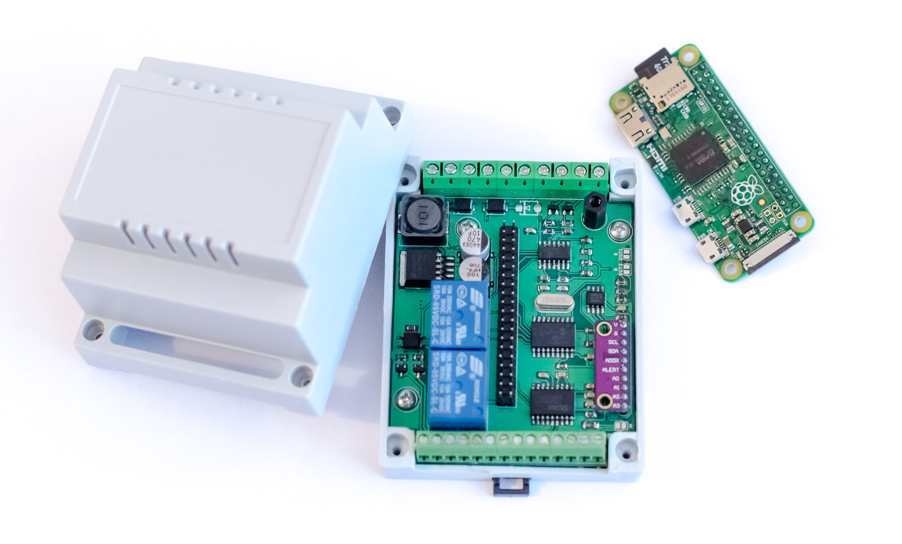

# Raspberry Pi Zero/W based PLC
DIN mount PLC with following features
- power supply 7-45V DC
- 2x SPDT relay
- 1x SSR relay output (positive)
- 4x mosfet output (negative)
- 4x opto-isolated digital inputs with hardware debounce
- 3x analog input + 1 additional for power supply monitoring
- 1x CAN interface
- 1x RS232 (can be used for console or as standalone serial port)

## Picture

## BOM

| Qty | Component | Value | Package |
|:---:| --------- | ----- | ------- |
| 4 | Capacitor | 1uF/6.3V | C0805 |
| 2 | Capacitor | 10uF/6.3V | C0805 |
| 2 | Capacitor | 22p | C0805 |
| 12 | Capacitor | 100n | C0805 |
| 1 | Capacitor | 100uF/50V | PANASONIC_E |
| 1 | Capacitor | 470uF/10V | PANASONIC_E |
| 6 | Diode | S1B | DO214AC (SMA) |
| 1 | TVS | SMBJ33 | DO214AA (SMB) |
| 2 | Shottky diode| SS26 | DO214AA (SMB) |
| 1 | NAND Schmitt trigger | 74HC132D | SO14 |
| 1 | CAN controller | MCP2515-I/SO | SO-18L |
| 1 | RS232 driver | SP3222EET | SO-18L |
| 1 | CAN transceiver | TJA1050 | SO08 |
| 4 | Photocoupler | TLP185 | SOP04 |
| 1 | SSR relay | AQY212S | SOP04 |
| 2 | Realy | SRD-5VDC-SL-C | |
| 1 | Inductor | DE1207-100 | DR125 |
| 4 | N-mosfet | 2N7002 | SOT23 |
| 1 | Crystal | 16MHz | HC49U-V |
| 2 | PNP transistor | BCX71SMD | SOT23 |
| 1 | P-mosfet | DMG2305UX | SOT23 |
| 2 | N-mosfet | IRLML0060TRPBF SOT23 |
| 5 | Resistor| 1K | R0805 |
| 5 | Resistor| 2K2 | R0805 |
| 4 | Resistor| 10K | R0805 |
| 1 | Resistor| 18K | R0805 |
| 3 | Resistor| 47K | R0805 |
| 4 | Resistor| 68K | R0805 |
| 6 | Resistor| 100K | R0805 |
| 1 | Resistor| 120R | R1206 |
| 4 | Resistor| 820K | R0805 |
| 1 | ADC | ADS1015 | module |
| 1 | LDO regulator | LM1117-3.3 | SOT223 |
| 1 | Step-down regulator | LM2576-5.0 | TO-263-5 |
| 1 | Raspberry Pi | Zero | |
| 2 | Screw terminal| KF301-5.0-2P | KF301-5.0-2P |
| 2 | Screw terminal| KF301-5.0-3P | KF301-5.0-3P |
| 7 | Screw terminal| KF350-3.5-2P | KF350-3.50-2P |
| 1 | DIN case | Z100J PS | |

